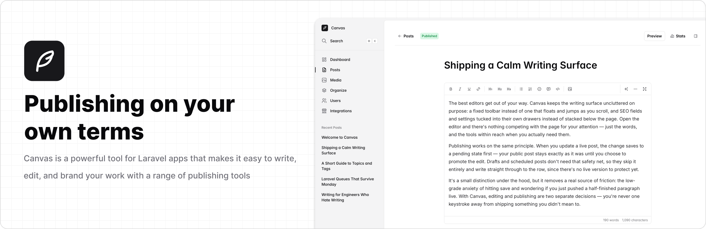

<p align="center">
    <a href="https://trycanvas.app">
        
    </a>
</p>

<p align="center">
    <a href="https://github.com/austintoddj/canvas/actions"></a>
    <a href="https://packagist.org/packages/austintoddj/canvas"></a>
    <a href="https://packagist.org/packages/austintoddj/canvas"></a>
    <a href="https://packagist.org/packages/austintoddj/canvas"></a>
</p>

## About Canvas

Canvas is an open-source publishing platform for [Laravel](https://laravel.com). Drop it into an existing application, use your own authentication, and start writing.

- Distraction-free editor with tags, topics, and media uploads
- Monthly trends and reader insights
- Contributor, Editor, and Admin roles
- Integrations: Unsplash, AI writing, outbound webhooks, and weekly digest
- Optional starter reader frontend via `canvas:ui`

## Requirements

- PHP >= 8.3
- Laravel >= 12
- Working authentication for the guard Canvas uses (`web` by default)

## Installation

```bash
composer require austintoddj/canvas
php artisan canvas:install
```

Grant admin access to an existing user:

```bash
php artisan canvas:make-admin your@email.com
```

Visit `/canvas` in your browser.

Learn more about configuration in the [documentation](docs/configuration.md). Or to manage users and roles, see [authorization](docs/authorization.md).

## Canvas UI

Canvas UI is an optional public-facing blog. It is not required for Canvas to work.

```bash
php artisan canvas:ui
```

Visit `/canvas-ui` in your browser.

Learn more about Canvas UI in the [documentation](docs/canvas-ui.md). Or to build and customize your own frontend, see [content](docs/content.md).

## Upgrading

Canvas follows [Semantic Versioning](https://semver.org) and increments versions as `MAJOR.MINOR.PATCH`.

- **Major** versions may contain breaking changes — follow the [upgrade guide](.github/UPGRADE.md) for a step-by-step breakdown.
- **Minor** and **patch** versions should never contain breaking changes, so you can safely update by following the steps below.

```bash
composer update austintoddj/canvas
php artisan canvas:publish
```

To publish assets automatically after Composer updates, add this to your application’s `composer.json`:

```json
{
    "scripts": {
        "post-update-cmd": ["@php artisan canvas:publish --ansi"]
    }
}
```

## Contributing

Thank you for considering contributing to Canvas! The [contribution guide can be found here](https://github.com/austintoddj/canvas/blob/main/.github/CONTRIBUTING.md).

## Testing

```bash
composer test
```

## License

Canvas is open-sourced software licensed under the [MIT license](license).
